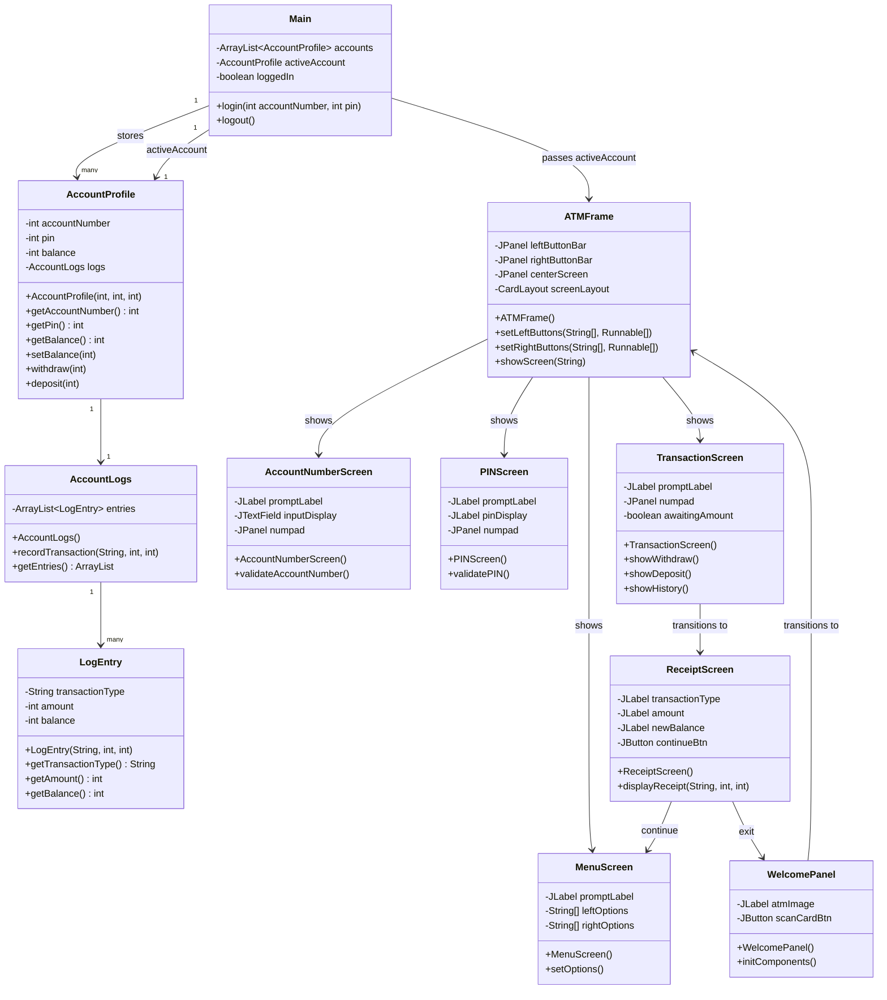
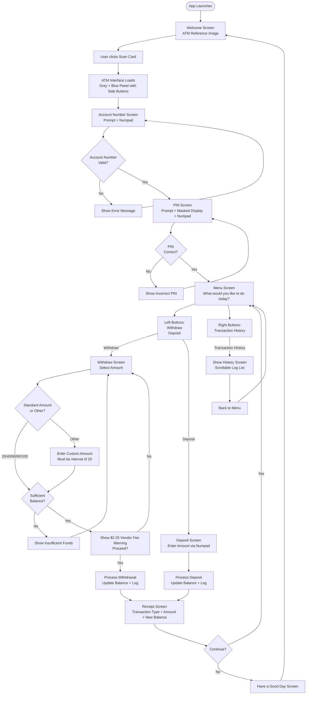

# ATM Interface — Class Diagram

```mermaid
classDiagram
    class Main {
        -ArrayList~AccountProfile~ accounts
        -AccountProfile activeAccount
        -boolean loggedIn
        +login(int accountNumber, int pin)
        +logout()
    }

    class AccountProfile {
        -int accountNumber
        -int pin
        -int balance
        -AccountLogs logs
        +AccountProfile(int, int, int)
        +getAccountNumber() int
        +getPin() int
        +getBalance() int
        +setBalance(int)
        +withdraw(int)
        +deposit(int)
    }

    class AccountLogs {
        -ArrayList~LogEntry~ entries
        +AccountLogs()
        +recordTransaction(String, int, int)
        +getEntries() ArrayList
    }

    class LogEntry {
        -String transactionType
        -int amount
        -int balance
        +LogEntry(String, int, int)
        +getTransactionType() String
        +getAmount() int
        +getBalance() int
    }

    class WelcomePanel {
        -JLabel atmImage
        -JButton scanCardBtn
        +WelcomePanel()
        +initComponents()
    }

    class ATMFrame {
        -JPanel leftButtonBar
        -JPanel rightButtonBar
        -JPanel centerScreen
        -CardLayout screenLayout
        +ATMFrame()
        +setLeftButtons(String[], Runnable[])
        +setRightButtons(String[], Runnable[])
        +showScreen(String)
    }

    class AccountNumberScreen {
        -JLabel promptLabel
        -JTextField inputDisplay
        -JPanel numpad
        +AccountNumberScreen()
        +validateAccountNumber()
    }

    class PINScreen {
        -JLabel promptLabel
        -JLabel pinDisplay
        -JPanel numpad
        +PINScreen()
        +validatePIN()
    }

    class MenuScreen {
        -JLabel promptLabel
        -String[] leftOptions
        -String[] rightOptions
        +MenuScreen()
        +setOptions()
    }

    class TransactionScreen {
        -JLabel promptLabel
        -JPanel numpad
        -boolean awaitingAmount
        +TransactionScreen()
        +showWithdraw()
        +showDeposit()
        +showHistory()
    }

    class ReceiptScreen {
        -JLabel transactionType
        -JLabel amount
        -JLabel newBalance
        -JButton continueBtn
        +ReceiptScreen()
        +displayReceipt(String, int, int)
    }

    Main "1" --> "many" AccountProfile : stores
    Main "1" --> "1" AccountProfile : activeAccount
    Main --> ATMFrame : passes activeAccount
    AccountProfile "1" --> "1" AccountLogs
    AccountLogs "1" --> "many" LogEntry
    WelcomePanel --> ATMFrame : transitions to
    ATMFrame --> AccountNumberScreen : shows
    ATMFrame --> PINScreen : shows
    ATMFrame --> MenuScreen : shows
    ATMFrame --> TransactionScreen : shows
    TransactionScreen --> ReceiptScreen : transitions to
    ReceiptScreen --> MenuScreen : continue
    ReceiptScreen --> WelcomePanel : exit
```

---

# ATM Interface — User Flow Diagram

```mermaid
flowchart TD
    A([App Launches]) --> B[Welcome Screen\nATM Reference Image]
    B --> C[User clicks Scan Card]
    C --> D[ATM Interface Loads\nGrey + Blue Panel with Side Buttons]

    D --> E[Account Number Screen\nPrompt + Numpad]
    E --> F{Account Number\nValid?}
    F -- No --> G[Show Error Message] --> E
    F -- Yes --> H[PIN Screen\nPrompt + Masked Display + Numpad]

    H --> I{PIN\nCorrect?}
    I -- No --> J[Show Incorrect PIN] --> H
    I -- Yes --> K[Menu Screen\nWhat would you like to do today?]

    K --> L[Left Buttons:\nWithdraw\nDeposit]
    K --> M[Right Buttons:\nTransaction History]

    L -- Withdraw --> N[Withdraw Screen\nSelect Amount]
    N --> O{Standard Amount\nor Other?}
    O -- 20/40/60/80/100 --> P{Sufficient\nBalance?}
    O -- Other --> Q[Enter Custom Amount\nMust be interval of 20] --> P
    P -- No --> R[Show Insufficient Funds] --> N
    P -- Yes --> S[Show $2.25 Vendor Fee Warning\nProceed?]
    S -- No --> N
    S -- Yes --> T[Process Withdrawal\nUpdate Balance + Log]

    L -- Deposit --> U[Deposit Screen\nEnter Amount via Numpad]
    U --> V[Process Deposit\nUpdate Balance + Log]

    M -- Transaction History --> W[Show History Screen\nScrollable Log List]
    W --> X[Back to Menu] --> K

    T --> Y[Receipt Screen\nTransaction Type + Amount + New Balance]
    V --> Y

    Y --> Z{Continue?}
    Z -- Yes --> K
    Z -- No --> AA[Have a Good Day Screen] --> B
```
