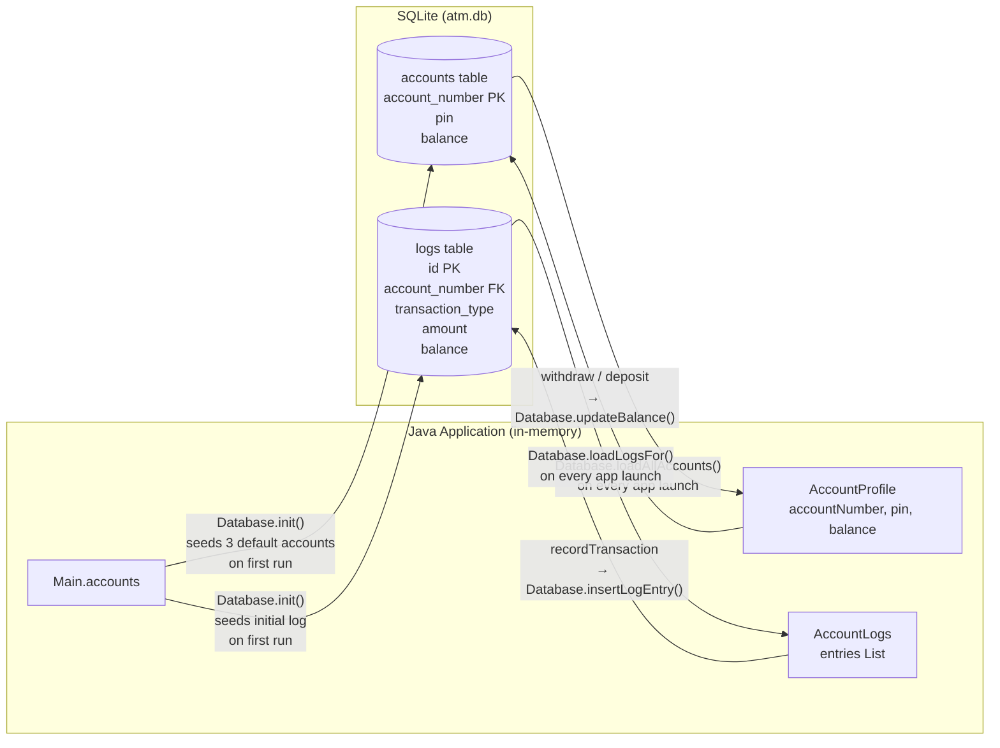
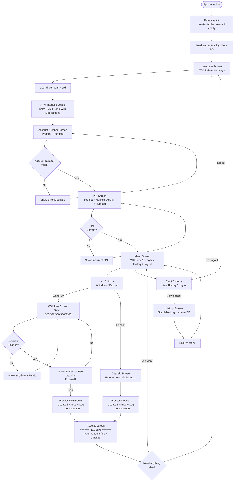

# ATM Interface — Class Diagram

```mermaid
classDiagram
    class Main {
        +ArrayList~AccountProfile~ accounts
        +AccountProfile activeAccount
        +boolean isLoggedIn
        +main(String[])
        +login(int accountNumber, String pin) boolean
        +logout()
    }

    class Database {
        -String DB_URL
        +getConnection() Connection
        +init()
        +loadAllAccounts() List
        +loadLogsFor(int) List
        +updateBalance(int, int)
        +insertLogEntry(int, String, int, int)
    }

    class AccountProfile {
        -int accountNumber
        -String pin
        -int balance
        -AccountLogs accountLogs
        +AccountProfile(int, String, int)
        +getAccountNumber() int
        +getPin() String
        +getBalance() int
        +setBalance(int)
        +getLogs() AccountLogs
        +withdraw(int)
        +deposit(int)
    }

    class AccountLogs {
        -int accountNumber
        -ArrayList~LogEntry~ entries
        +AccountLogs(int)
        +addLoadedEntry(LogEntry)
        +recordTransaction(String, int, int)
        +getEntries() ArrayList
    }

    class LogEntry {
        -String transactionType
        -int amount
        -int balance
        +LogEntry(String, int, int)
        +getTransactionType() String
        +getAmount() int
        +getBalance() int
    }

    class ScreenPanel {
        #ATMFrame parent
        +ScreenPanel(ATMFrame, String)
        +onShow()
    }

    class ATMFrame {
        -CardLayout screenLayout
        -JPanel screenHost
        -JButton[] digitButtons
        -JButton[] leftButtons
        -JButton[] rightButtons
        +int pendingAccountNumber
        +String pendingTransactionMode
        +String lastTransactionType
        +int lastTransactionAmount
        +int lastTransactionBalance
        +registerScreen(String, ScreenPanel)
        +showScreen(String)
        +setNumpadHandlers(IntConsumer, Runnable, Runnable, Runnable)
        +setLeftButtonActions(Runnable[])
        +setRightButtonActions(Runnable[])
    }

    class WelcomePanel {
        -JButton scanCardBtn
        +WelcomePanel(ATMFrame)
    }

    class AccountNumberScreen {
        -StringBuilder input
        -JLabel displayLabel
        +AccountNumberScreen(ATMFrame)
        +onShow()
    }

    class PINScreen {
        -StringBuilder input
        -JLabel displayLabel
        +PINScreen(ATMFrame)
        +onShow()
    }

    class MenuScreen {
        +MenuScreen(ATMFrame)
        +onShow()
    }

    class TransactionScreen {
        -String mode
        -StringBuilder amountInput
        +TransactionScreen(ATMFrame)
        +onShow()
    }

    class HistoryScreen {
        -JTextArea historyArea
        +HistoryScreen(ATMFrame)
        +onShow()
    }

    class ReceiptScreen {
        -JLabel typeLabel
        -JLabel amountLabel
        -JLabel balanceLabel
        +ReceiptScreen(ATMFrame)
        +onShow()
    }

    Main "1" --> "many" AccountProfile : stores
    Main "1" --> "1" AccountProfile : activeAccount
    Main --> ATMFrame : launches
    Main ..> Database : init() / loadAllAccounts()
    AccountProfile "1" --> "1" AccountLogs
    AccountProfile ..> Database : updateBalance()
    AccountLogs "1" --> "many" LogEntry
    AccountLogs ..> Database : insertLogEntry()
    Database ..> AccountProfile : creates from rows
    Database ..> LogEntry : creates from rows

    ScreenPanel <|-- WelcomePanel
    ScreenPanel <|-- AccountNumberScreen
    ScreenPanel <|-- PINScreen
    ScreenPanel <|-- MenuScreen
    ScreenPanel <|-- TransactionScreen
    ScreenPanel <|-- HistoryScreen
    ScreenPanel <|-- ReceiptScreen

    ATMFrame --> ScreenPanel : registers / shows
    WelcomePanel --> AccountNumberScreen : Scan Card
    AccountNumberScreen --> PINScreen : valid account
    PINScreen --> MenuScreen : correct PIN
    MenuScreen --> TransactionScreen : Withdraw / Deposit
    MenuScreen --> HistoryScreen : View History
    MenuScreen --> WelcomePanel : Logout
    TransactionScreen --> ReceiptScreen : on success
    ReceiptScreen --> MenuScreen : Yes (continue)
    ReceiptScreen --> WelcomePanel : No (logout)
    HistoryScreen --> MenuScreen : back
```

---

# ATM Interface — Persistence Diagram

```mermaid
flowchart LR
    subgraph App["Java Application (in-memory)"]
        Main_[Main.accounts]
        AP[AccountProfile<br/>accountNumber, pin, balance]
        AL[AccountLogs<br/>entries List]
    end

    subgraph DB["SQLite (atm.db)"]
        T1[(accounts table<br/>account_number PK<br/>pin<br/>balance)]
        T2[(logs table<br/>id PK<br/>account_number FK<br/>transaction_type<br/>amount<br/>balance)]
    end

    Main_ -->|"Database.init()<br/>seeds 3 default accounts<br/>on first run"| T1
    Main_ -->|"Database.init()<br/>seeds initial log<br/>on first run"| T2

    T1 -->|"Database.loadAllAccounts()<br/>on every app launch"| AP
    T2 -->|"Database.loadLogsFor()<br/>on every app launch"| AL

    AP -->|"withdraw / deposit<br/>→ Database.updateBalance()"| T1
    AL -->|"recordTransaction<br/>→ Database.insertLogEntry()"| T2
```

---

# ATM Interface — User Flow Diagram

```mermaid
flowchart TD
    A([App Launches]) --> A2[Database.init<br/>creates tables, seeds if empty]
    A2 --> A3[Load accounts + logs from DB]
    A3 --> B[Welcome Screen<br/>ATM Reference Image]
    B --> C[User clicks Scan Card]
    C --> D[ATM Interface Loads<br/>Grey + Blue Panel with Side Buttons]

    D --> E[Account Number Screen<br/>Prompt + Numpad]
    E --> F{Account Number<br/>Valid?}
    F -- No --> G[Show Error Message] --> E
    F -- Yes --> H[PIN Screen<br/>Prompt + Masked Display + Numpad]

    H --> I{PIN<br/>Correct?}
    I -- No --> J[Show Incorrect PIN] --> H
    I -- Yes --> K[Menu Screen<br/>Withdraw / Deposit / History / Logout]

    K --> L[Left Buttons:<br/>Withdraw / Deposit]
    K --> M[Right Buttons:<br/>View History / Logout]

    L -- Withdraw --> N[Withdraw Screen<br/>Select $20/$40/$60/$80/$100]
    N --> P{Sufficient<br/>Balance?}
    P -- No --> R[Show Insufficient Funds] --> N
    P -- Yes --> S[Show $2 Vendor Fee Warning<br/>Proceed?]
    S -- No --> N
    S -- Yes --> T[Process Withdrawal<br/>Update Balance + Log<br/>→ persist to DB]

    L -- Deposit --> U[Deposit Screen<br/>Enter Amount via Numpad]
    U --> V[Process Deposit<br/>Update Balance + Log<br/>→ persist to DB]

    M -- View History --> W[History Screen<br/>Scrollable Log List from DB]
    W --> X[Back to Menu] --> K

    T --> Y[Receipt Screen<br/>====== RECEIPT ======<br/>Type / Amount / New Balance]
    V --> Y

    Y --> Z{Need anything<br/>else?}
    Z -- Yes Menu --> K
    Z -- No Logout --> B

    M -- Logout --> B
```
