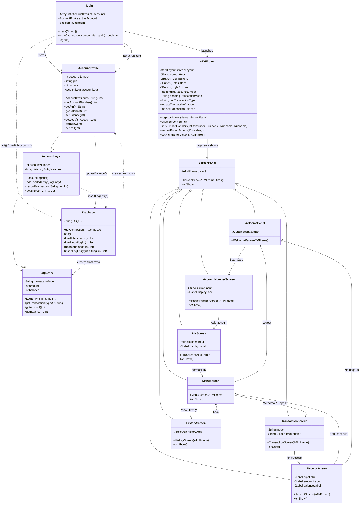

# ATM Interface — Class Diagram

```mermaid
classDiagram
    class Main {
        +ArrayList~AccountProfile~ accounts
        +AccountProfile activeAccount
        +boolean isLoggedIn
        +main(String[])
        +login(int accountNumber, String pin) boolean
        +logout()
    }

    class Database {
        -String DB_URL
        +getConnection() Connection
        +init()
        +loadAllAccounts() List
        +loadLogsFor(int) List
        +updateBalance(int, int)
        +insertLogEntry(int, String, int, int)
    }

    class AccountProfile {
        -int accountNumber
        -String pin
        -int balance
        -AccountLogs accountLogs
        +AccountProfile(int, String, int)
        +getAccountNumber() int
        +getPin() String
        +getBalance() int
        +setBalance(int)
        +getLogs() AccountLogs
        +withdraw(int)
        +deposit(int)
    }

    class AccountLogs {
        -int accountNumber
        -ArrayList~LogEntry~ entries
        +AccountLogs(int)
        +addLoadedEntry(LogEntry)
        +recordTransaction(String, int, int)
        +getEntries() ArrayList
    }

    class LogEntry {
        -String transactionType
        -int amount
        -int balance
        +LogEntry(String, int, int)
        +getTransactionType() String
        +getAmount() int
        +getBalance() int
    }

    class ScreenPanel {
        #ATMFrame parent
        +ScreenPanel(ATMFrame, String)
        +onShow()
    }

    class ATMFrame {
        -CardLayout screenLayout
        -JPanel screenHost
        -JButton[] digitButtons
        -JButton[] leftButtons
        -JButton[] rightButtons
        +int pendingAccountNumber
        +String pendingTransactionMode
        +String lastTransactionType
        +int lastTransactionAmount
        +int lastTransactionBalance
        +registerScreen(String, ScreenPanel)
        +showScreen(String)
        +setNumpadHandlers(IntConsumer, Runnable, Runnable, Runnable)
        +setLeftButtonActions(Runnable[])
        +setRightButtonActions(Runnable[])
    }

    class WelcomePanel {
        -JButton scanCardBtn
        +WelcomePanel(ATMFrame)
    }

    class AccountNumberScreen {
        -StringBuilder input
        -JLabel displayLabel
        +AccountNumberScreen(ATMFrame)
        +onShow()
    }

    class PINScreen {
        -StringBuilder input
        -JLabel displayLabel
        +PINScreen(ATMFrame)
        +onShow()
    }

    class MenuScreen {
        +MenuScreen(ATMFrame)
        +onShow()
    }

    class TransactionScreen {
        -String mode
        -StringBuilder amountInput
        +TransactionScreen(ATMFrame)
        +onShow()
    }

    class HistoryScreen {
        -JTextArea historyArea
        +HistoryScreen(ATMFrame)
        +onShow()
    }

    class ReceiptScreen {
        -JLabel typeLabel
        -JLabel amountLabel
        -JLabel balanceLabel
        +ReceiptScreen(ATMFrame)
        +onShow()
    }

    Main "1" --> "many" AccountProfile : stores
    Main "1" --> "1" AccountProfile : activeAccount
    Main --> ATMFrame : launches
    Main ..> Database : init() / loadAllAccounts()
    AccountProfile "1" --> "1" AccountLogs
    AccountProfile ..> Database : updateBalance()
    AccountLogs "1" --> "many" LogEntry
    AccountLogs ..> Database : insertLogEntry()
    Database ..> AccountProfile : creates from rows
    Database ..> LogEntry : creates from rows

    ScreenPanel <|-- WelcomePanel
    ScreenPanel <|-- AccountNumberScreen
    ScreenPanel <|-- PINScreen
    ScreenPanel <|-- MenuScreen
    ScreenPanel <|-- TransactionScreen
    ScreenPanel <|-- HistoryScreen
    ScreenPanel <|-- ReceiptScreen

    ATMFrame --> ScreenPanel : registers / shows
    WelcomePanel --> AccountNumberScreen : Scan Card
    AccountNumberScreen --> PINScreen : valid account
    PINScreen --> MenuScreen : correct PIN
    MenuScreen --> TransactionScreen : Withdraw / Deposit
    MenuScreen --> HistoryScreen : View History
    MenuScreen --> WelcomePanel : Logout
    TransactionScreen --> ReceiptScreen : on success
    ReceiptScreen --> MenuScreen : Yes (continue)
    ReceiptScreen --> WelcomePanel : No (logout)
    HistoryScreen --> MenuScreen : back
```
